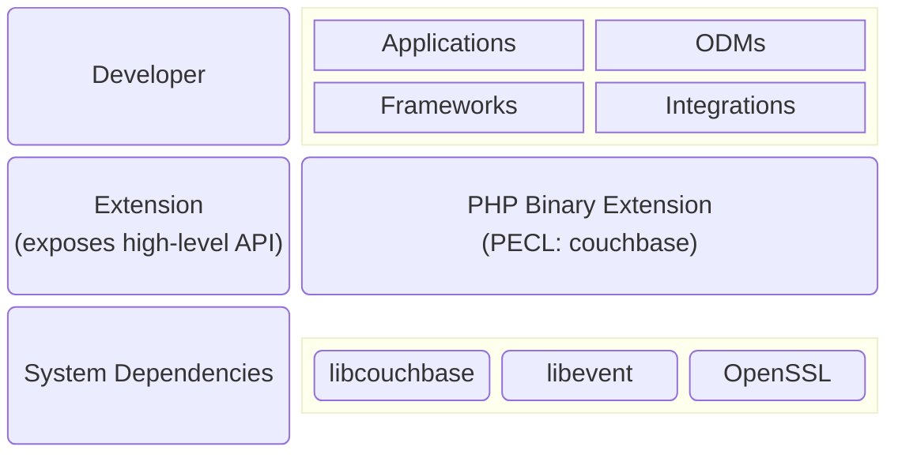
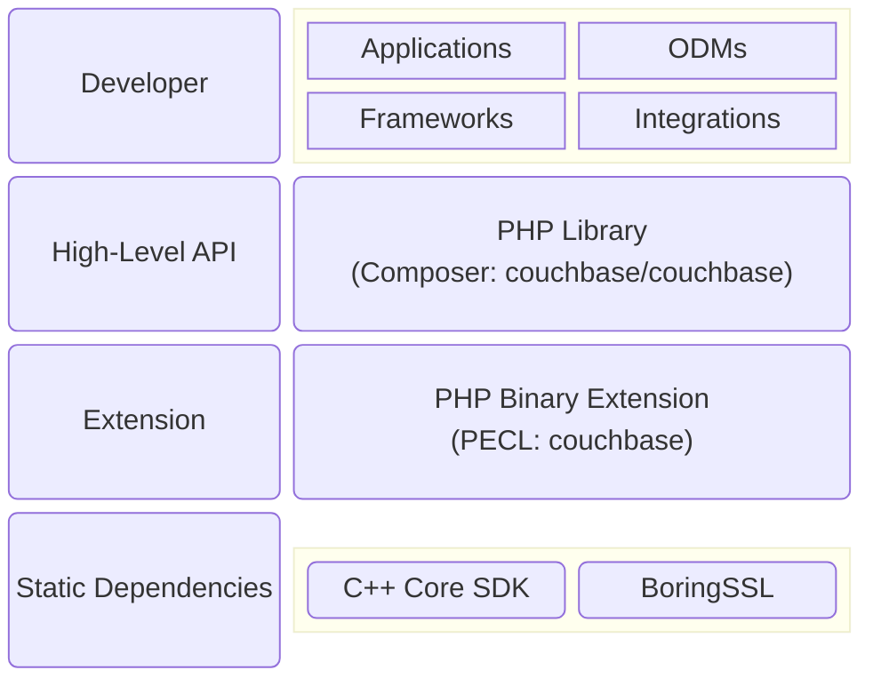

# Migration Guide for 3.x Branch

Couchbase PHP SDK v4 brought a lot of improvements to the API. Some of the changes unfortunately break
compatibility with v3. This guide helps upgrade applications, and highlights the most important
differences.

API Reference: https://docs.couchbase.com/sdk-api/couchbase-php-client

## Components Overview

The following diagram illustrates the architecture of PHP SDK v3:




The following diagram illustrates the architecture of PHP SDK v4:



So let us point out immediate differences:

1. SDKv4 uses Composer to deliver high-level API classes, while SDKv3 defines everything in the
   extension. While it adds an extra step for the developer, it really simplifies maintenance, reduces
   potential memory issues, allows to keep documentation consistent and improves IDE integration.

   It is really easy add classes to the application using Composer.
   ```bash
   composer require couchbase/couchbase
   ```

   the resulting `composer.json` needs only two lines to be added:
   ```diff
   diff --git i/composer.json w/composer.json
   index b743a66..88e69da 100644
   --- i/composer.json
   +++ w/composer.json
   @@ -24,6 +24,8 @@
        "require": {
            "php": "^7.4 || ^8.0",
            "ext-json": "*",
   +        "ext-couchbase": "^4.2",
   +        "couchbase/couchbase": "^4.2",
            "monolog/monolog": "^2.3",
            "php-di/php-di": "^6.3",
            "slim/psr7": "^1.5",
   ```

   In case Composer cannot be used, we also have autoloader script `Couchbase\autoload.php`,
   that sets up a hook to resolve and automatically require SDK classes, but to use this autoloader,
   the headers must be installed somewhere in the PHP include path, which could be found using one of
   the following commands, or in the `phpinfo()` output.
   ```
   $ pecl config-get php_dir
   /usr/share/pear
   ```
   ```
   $ php -r 'printf("%s\n", ini_get("include_path"));'
   .:/usr/share/pear:/usr/share/php
   ```

2. Another important observation is that SDKv4 does not expect any system libraries or headers to be
   installed to work and uses a statically compiled core implementation (just like all other
   wrappers). Additionally, it statically links the TLS library to the extension, which, again, simplifies
   deployment on the Windows platform.

## Transcoder API

SDKv3 used a non-standard way of specifying an encoder and decoder for the document objects for the KV API.
This API was inherited from SDKv2, where the developer needed to specify a decoder or
encoder function in the options. SDKv4 fixes this and instead defines the `\Couchbase\Transcoder`
interface which encapsulates all the logic. Additionally, it provides four implementations of it
and uses `\Couchbase\JsonTranscoder` by default.

Let's say we want to read/write documents without any conversion, just as a binary streams. To do so,
we would need to override the transcoder, because otherwise our byte strings will be serialized as JSON
strings.

Here is how it is done with SDKv3:

```php
$options = new \Couchbase\ClusterOptions();
$options->credentials("Administrator", "password");
$cluster = new \Couchbase\Cluster("couchbase://localhost", $options);
$collection = $cluster->bucket("default")->defaultCollection();

$passThruDecoder = function($bytes, $flags, $datatype) {
    // do not check anything just return bytes as passed by core
    return $bytes;
};

$passThruEncoder = function($value) {
    // do not do conversion, and return zeroes for datatype and flags
    return [$value, 0x00, 0x00];
};


// Mutation operations in SDKv3 explicitly ask for encoder callable
$options = new \Couchbase\UpsertOptions();
$options->encoder($passThruEncoder);
$collection->upsert("foo", "BINARY DATA: \xDE\xAD\xBE\xEF", $options);

// Retrieval operation in SDKv3 only allow decoder callable
$options = new \Couchbase\GetOptions();
$options->decoder($passThruDecoder);
$res = $collection->get("foo", $options);
var_dump($res->content());
```

With SDKv4 we ship `\Couchbase\RawBinaryTranscoder`, which could be reimplemented as the following:

```php
class PassThruTranscoder implements \Couchbase\Transcoder
{
    public function encode($value): array
    {
        return [
            $value,
            (new \Couchbase\TranscoderFlags(\Couchbase\TranscoderFlags::DATA_FORMAT_BINARY))->encode(),
        ];
    }

    public function decode(string $bytes, int $flags)
    {
        return $bytes;
    }
}

// RawBinaryTranscoder like any other implementation has static method getInstance() returning
// singleton object.
$passThruTranscoder = new PassThruTranscoder();

$options = new \Couchbase\UpsertOptions();
$options->transcoder($passThruTranscoder);
$collection->upsert("foo", "BINARY DATA: \xDE\xAD\xBE\xEF", $options);

$options = new \Couchbase\GetOptions();
$options->transcoder($passThruTranscoder);
$res = $collection->get("foo", $options);
var_dump($res->content());
```

## Error Handling

SDKv4 moved exceptions into the `\Couchbase\Exception` namespace, so if the application used to catch
and handle exceptions from the SDK, those places should update to use the new names.

<table>
    <thead>
        <tr>
            <th>SDKv3 exception</th>
            <th>SDKv4 exception</th>
        <tr>
    </thead>
    <tbody>
        <tr><td>\Couchbase\AuthenticationException</td>       <td>\Couchbase\Exception\AuthenticationFailureException</td></tr>
        <tr><td>\Couchbase\BadInputException</td>             <td>\Couchbase\Exception\InvalidArgumentException</td></tr>
        <tr>
            <td>
                <ul>
                    <li>\Couchbase\BucketMissingException</li>
                    <li>\Couchbase\KeyspaceNotFoundException</li>
                </ul>
            </td>
            <td>\Couchbase\Exception\BucketNotFoundException</td>
        </tr>
        <tr><td>\Couchbase\CasMismatchException</td>          <td>\Couchbase\Exception\CasMismatchException</td></tr>
        <tr><td>\Couchbase\CollectionMissingException</td>    <td>\Couchbase\Exception\CollectionNotFoundException</td></tr>
        <tr>
            <td>\Couchbase\DurabilityException</td>
            <td>
                One of the more specific exceptions.
                <ul>
                    <li>\Couchbase\Exception\DurabilityAmbiguousException</li>
                    <li>\Couchbase\Exception\DurabilityImpossibleException</li>
                    <li>\Couchbase\Exception\DurabilityLevelNotAvailableException</li>
                    <li>\Couchbase\Exception\DurableWriteInProgressException</li>
                    <li>\Couchbase\Exception\DurableWriteReCommitInProgressException</li>
                </ul>
            </td>
        </tr>
        <tr>
            <td>\Couchbase\DmlFailureException</td>
            <td>
                The SDK will detect the underlying error that caused the query to fail and throw
                the specific exception.
                <ul>
                    <li>\Couchbase\Exception\CasMismatchException</li>
                    <li>\Couchbase\Exception\DocumentExistsException</li>
                    <li>\Couchbase\Exception\DocumentLockedException</li>
                    <li>etc.</li>
                </ul>
            </td>
        </tr>
        <tr><td>\Couchbase\DocumentNotFoundException</td>               <td>\Couchbase\Exception\DocumentNotFoundException</td></tr>
        <tr><td>\Couchbase\IndexFailureException</td>                   <td>\Couchbase\Exception\IndexFailureException</td></tr>
        <tr><td>\Couchbase\IndexNotFoundException</td>                  <td>\Couchbase\Exception\IndexNotFoundException</td></tr>
        <tr><td>\Couchbase\InvalidRangeException</td>                   <td>\Couchbase\Exception\DeltaInvalidException</td></tr>
        <tr><td>\Couchbase\KeyDeletedException</td>                     <td>Removed</td></tr>
        <tr><td>\Couchbase\KeyExistsException</td>                      <td>\Couchbase\Exception\DocumentExistsException</td></tr>
        <tr><td>\Couchbase\KeyLockedException</td>                      <td>\Couchbase\Exception\DocumentLockedException</td></tr>
        <tr><td>\Couchbase\ParsingFailureException</td>                 <td>\Couchbase\Exception\ParsingFailureException</td></tr>
        <tr><td>\Couchbase\PartialViewException</td>                    <td>Removed</td></tr>
        <tr><td>\Couchbase\PathExistsException</td>                     <td>\Couchbase\Exception\PathExistsException</td></tr>
        <tr><td>\Couchbase\PathNotFoundException</td>                   <td>\Couchbase\Exception\PathNotFoundException</td></tr>
        <tr><td>\Couchbase\PlanningFailureException</td>                <td>\Couchbase\Exception\PlanningFailureException</td></tr>
        <tr><td>\Couchbase\PreparedStatementFailureException</td>       <td>\Couchbase\Exception\PreparedStatementFailureException</td></tr>
        <tr>
            <td>
                <ul>
                    <li>\Couchbase\QuotaLimitedException</li>
                    <li>\Couchbase\RateLimitedException</li>
                </ul>
            </td>
            <td>Rate and Quota limit exceptions redesigned, and the SDK will not use them.</td>
        </tr>
        <tr><td>\Couchbase\RequestCanceledException</td>                <td>\Couchbase\Exception\RequestCanceledException</td></tr>
        <tr><td>\Couchbase\ScopeMissingException</td>                   <td>\Couchbase\Exception\ScopeNotFoundException</td></tr>
        <tr><td>\Couchbase\ServiceNotAvailableException</td>            <td>\Couchbase\Exception\ServiceNotAvailableException</td></tr>
        <tr><td>\Couchbase\TempFailException</td>                       <td>\Couchbase\Exception\TemporaryFailureException</td></tr>
        <tr><td>\Couchbase\TimeoutException</td>                        <td>\Couchbase\Exception\TimeoutException</td></tr>
        <tr><td>\Couchbase\ValueTooBigException</td>                    <td>\Couchbase\Exception\ValueTooLargeException</td></tr>
        <tr>
            <td>
                <ul>
                    <li>\Couchbase\AnalyticsException</li>
                    <li>\Couchbase\BindingsException</li>
                    <li>\Couchbase\InvalidConfigurationException</li>
                    <li>\Couchbase\InvalidStateException</li>
                    <li>\Couchbase\KeyValueException</li>
                    <li>\Couchbase\NetworkException</li>
                    <li>\Couchbase\QueryErrorException</li>
                    <li>\Couchbase\QueryException</li>
                    <li>\Couchbase\QueryServiceException</li>
                    <li>\Couchbase\SearchException</li>
                    <li>\Couchbase\SubdocumentException</li>
                    <li>\Couchbase\ViewException</li>
                </ul>
            </td>
            <td>
                All generic exceptions mapped to \Couchbase\Exception\CouchbaseException or to one
                of the new, more specific exceptions.
                <ul>
                    <li>\Couchbase\Exception\CollectionExistsException</li>
                    <li>\Couchbase\Exception\CompilationFailureException</li>
                    <li>\Couchbase\Exception\ConsistencyMismatchException</li>
                    <li>\Couchbase\Exception\DatasetExistsException</li>
                    <li>\Couchbase\Exception\DatasetNotFoundException</li>
                    <li>\Couchbase\Exception\DataverseExistsException</li>
                    <li>\Couchbase\Exception\DataverseNotFoundException</li>
                    <li>\Couchbase\Exception\DecodingFailureException</li>
                    <li>\Couchbase\Exception\DesignDocumentNotFoundException</li>
                    <li>\Couchbase\Exception\DocumentIrretrievableException</li>
                    <li>\Couchbase\Exception\DocumentNotJsonException</li>
                    <li>\Couchbase\Exception\DocumentNotLockedException</li>
                    <li>\Couchbase\Exception\EncodingFailureException</li>
                    <li>\Couchbase\Exception\FeatureNotAvailableException</li>
                    <li>\Couchbase\Exception\GroupNotFoundException</li>
                    <li>\Couchbase\Exception\IndexExistsException</li>
                    <li>\Couchbase\Exception\IndexNotReadyException</li>
                    <li>\Couchbase\Exception\InternalServerFailureException</li>
                    <li>\Couchbase\Exception\JobQueueFullException</li>
                    <li>\Couchbase\Exception\LinkExistsException</li>
                    <li>\Couchbase\Exception\LinkNotFoundException</li>
                    <li>\Couchbase\Exception\NumberTooBigException</li>
                    <li>\Couchbase\Exception\PathInvalidException</li>
                    <li>\Couchbase\Exception\PathMismatchException</li>
                    <li>\Couchbase\Exception\PathTooBigException</li>
                    <li>\Couchbase\Exception\PathTooDeepException</li>
                    <li>\Couchbase\Exception\PermissionDeniedException</li>
                    <li>\Couchbase\Exception\ScopeExistsException</li>
                    <li>\Couchbase\Exception\TransactionCommitAmbiguousException</li>
                    <li>\Couchbase\Exception\TransactionException</li>
                    <li>\Couchbase\Exception\TransactionExpiredException</li>
                    <li>\Couchbase\Exception\TransactionFailedException</li>
                    <li>\Couchbase\Exception\TransactionOperationFailedException</li>
                    <li>\Couchbase\Exception\UnambiguousTimeoutException</li>
                    <li>\Couchbase\Exception\UnsupportedOperationException</li>
                    <li>\Couchbase\Exception\UserExistsException</li>
                    <li>\Couchbase\Exception\UserNotFoundException</li>
                    <li>\Couchbase\Exception\ValueInvalidException</li>
                    <li>\Couchbase\Exception\ValueTooDeepException</li>
                    <li>\Couchbase\Exception\ViewNotFoundException</li>
                    <li>\Couchbase\Exception\XattrCannotModifyVirtualAttributeException</li>
                    <li>\Couchbase\Exception\XattrInvalidKeyComboException</li>
                    <li>\Couchbase\Exception\XattrUnknownMacroException</li>
                    <li>\Couchbase\Exception\XattrUnknownVirtualAttributeException</li>
                </ul>
            </td>
        </tr>
    </tbody>
</table>

## String-backed Enumerations

In SDKv4 various enumerations and constants changed their types from `int` to `string` to reduce
potential issues. In general nothing has to be changed here, but in some cases names of the types
slightly changed to be more consistent with other SDKs.

### View Consistency

<table>
    <thead>
        <tr>
            <th>SDKv3</th>
            <th>SDKv4</th>
        <tr>
    </thead>
    <tbody>
        <tr>
            <td>\Couchbase\ViewScanConsistency::NOT_BOUNDED (0)</td>
            <td>\Couchbase\ViewConsistency::NOT_BOUNDED ("notBounded")</td>
        </tr>
        <tr>
            <td>\Couchbase\ViewScanConsistency::REQUEST_PLUS (1)</td>
            <td>\Couchbase\ViewConsistency::REQUEST_PLUS ("requestPlus")</td>
        </tr>
        <tr>
            <td>\Couchbase\ViewScanConsistency::UPDATE_AFTER (2)</td>
            <td>\Couchbase\ViewConsistency::UPDATE_AFTER ("updateAfter")</td>
        </tr>
    </tbody>
</table>

### View Ordering

<table>
    <thead>
        <tr>
            <th>SDKv3</th>
            <th>SDKv4</th>
        <tr>
    </thead>
    <tbody>
        <tr>
            <td>\Couchbase\ViewOrdering::ASCENDING (0)</td>
            <td>\Couchbase\ViewOrdering::ASCENDING ("ascending")</td>
        </tr>
        <tr>
            <td>\Couchbase\ViewOrdering::DESCENDING (1)</td>
            <td>\Couchbase\ViewOrdering::DESCENDING ("descending")</td>
        </tr>
    </tbody>
</table>

### Query Consistency

<table>
    <thead>
        <tr>
            <th>SDKv3</th>
            <th>SDKv4</th>
        <tr>
    </thead>
    <tbody>
        <tr>
            <td>\Couchbase\QueryScanConsistency::NOT_BOUNDED (1)</td>
            <td>\Couchbase\QueryScanConsistency::NOT_BOUNDED ("notBounded")</td>
        </tr>
        <tr>
            <td>\Couchbase\QueryScanConsistency::REQUEST_PLUS (2)</td>
            <td>\Couchbase\QueryScanConsistency::REQUEST_PLUS ("requestPlus")</td>
        </tr>
        <tr>
            <td>\Couchbase\QueryScanConsistency::STATEMENT_PLUS (3)</td>
            <td>Removed</td>
        </tr>
    </tbody>
</table>

### Query Profile

<table>
    <thead>
        <tr>
            <th>SDKv3</th>
            <th>SDKv4</th>
        <tr>
    </thead>
    <tbody>
        <tr>
            <td>\Couchbase\QueryProfile::OFF (1)</td>
            <td>\Couchbase\QueryProfile::OFF ("off")</td>
        </tr>
        <tr>
            <td>\Couchbase\QueryProfile::PHASES (2)</td>
            <td>\Couchbase\QueryProfile::PHASES ("phases")</td>
        </tr>
        <tr>
            <td>\Couchbase\QueryProfile::TIMINGS (3)</td>
            <td>\Couchbase\QueryProfile::TIMINGS ("timings")</td>
        </tr>
    </tbody>
</table>

### Analytics Consistency

<table>
    <thead>
        <tr>
            <th>SDKv3</th>
            <th>SDKv4</th>
        <tr>
    </thead>
    <tbody>
        <tr>
            <td>""</td>
            <td>\Couchbase\AnalyticsScanConsistency::NOT_BOUNDED ("notBounded")</td>
        </tr>
        <tr>
            <td>"request_plus"</td>
            <td>\Couchbase\AnalyticsScanConsistency::REQUEST_PLUS ("requestPlus")</td>
        </tr>
    </tbody>
</table>

## Changing Timeout Values

SDKv3 did not allow to set timeouts through `\Couchbase\ClusterOptions`, and the application have to
rely on connection string (that is handled by `libcouchbase` eventually), or use setter methods on
the `\Couchbase\Bucket` instance.

The table below shows correspondence of timeout values between `Bucket` object setters and
`ClusterOptions` in the new API.

<table>
    <thead>
        <tr>
            <th>SDKv3 (in microseconds)</th>
            <th>SDKv4 (in milliseconds)</th>
        <tr>
    </thead>
    <tbody>
        <tr>
            <td>Bucket::operationTimeout()</td>
            <td>ClusterOptions::keyValueTimeout()</td>
        </tr>
        <tr>
            <td>Bucket::viewTimeout()</td>
            <td>ClusterOptions::viewTimeout()</td>
        </tr>
        <tr>
            <td>Bucket::n1qlTimeout()</td>
            <td>ClusterOptions::queryTimeout()</td>
        </tr>
        <tr>
            <td>Bucket::durabilityInterval()</td>
            <td>Removed</td>
        </tr>
        <tr>
            <td>Bucket::durabilityTimeout()</td>
            <td>ClusterOptions::keyValueDurableTimeout()</td>
        </tr>
        <tr>
            <td>Bucket::configTimeout()</td>
            <td>ClusterOptions::bootstrapTimeout()</td>
        </tr>
        <tr>
            <td>Bucket::configDelay()</td>
            <td>Removed</td>
        </tr>
        <tr>
            <td>Bucket::configNodeTimeout()</td>
            <td>Removed</td>
        </tr>
        <tr>
            <td>Bucket::htconfigIdleTimeout()</td>
            <td>Removed</td>
        </tr>
        <tr>
            <td>Bucket::configPollInterval()</td>
            <td>ClusterOptions::configPollInterval()</td>
        </tr>
        <tr>
            <td>Bucket::httpTimeout()</td>
            <td>
                One of the service-related should be used:
                <ul>
                    <li>ClusterOptions::viewTimeout()</li>
                    <li>ClusterOptions::queryTimeout()</li>
                    <li>ClusterOptions::searchTimeout()</li>
                    <li>ClusterOptions::analyticsTimeout()</li>
                    <li>ClusterOptions::managementTimeout()</li>
                </ul>
            </td>
        </tr>
    </tbody>
</table>

## PHP INI Entries

<table>
    <thead>
        <tr>
            <th>SDKv3</th>
            <th>SDKv4</th>
        <tr>
    </thead>
    <tbody>
        <tr>
            <td>
                couchbase.log_level
                <ul>
                    <li>FATAL</li>
                    <li>ERROR</li>
                    <li>WARN</li>
                    <li>INFO</li>
                    <li>DEBUG</li>
                    <li>TRACE</li>
                </ul>
            </td>
            <td>
                couchbase.log_level
                <ul>
                    <li>fatal</li>
                    <li>error</li>
                    <li>wrning</li>
                    <li>info</li>
                    <li>debug</li>
                    <li>trace</li>
                </ul>
            </td>
        </tr>
        <tr>
            <td>couchbase.encoder.format</td>
            <td>Removed</td>
        </tr>
        <tr>
            <td>couchbase.encoder.compression</td>
            <td>Removed</td>
        </tr>
        <tr>
            <td>couchbase.encoder.compression_threshold</td>
            <td>Removed</td>
        </tr>
        <tr>
            <td>couchbase.encoder.compression_factor</td>
            <td>Removed</td>
        </tr>
        <tr>
            <td>couchbase.decoder.json_arrays</td>
            <td>Removed</td>
        </tr>
        <tr>
            <td>couchbase.pool.max_idle_time_sec</td>
            <td>couchbase.persistent_timeout</td>
        </tr>
        <tr>
            <td>couchbase.allow_fallback_to_bucket_connection</td>
            <td>Removed</td>
        </tr>
    </tbody>
</table>
